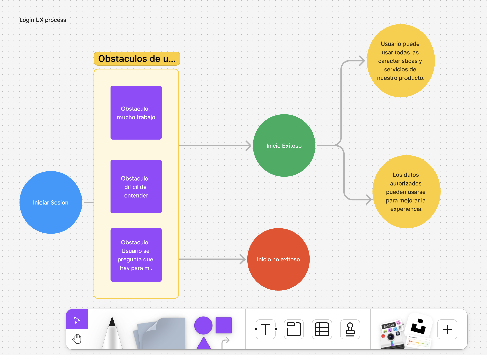
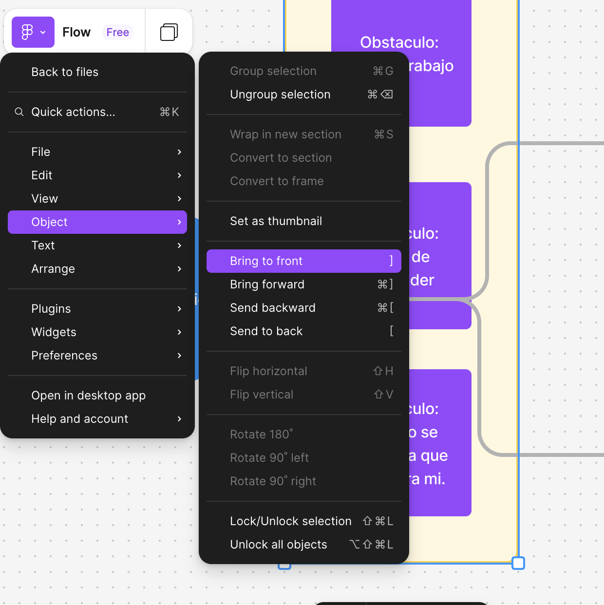
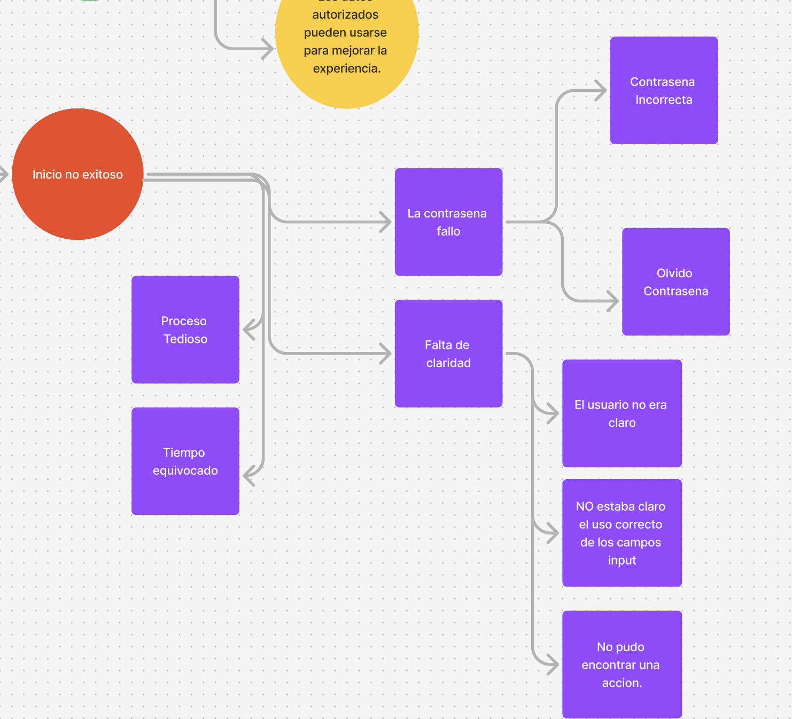
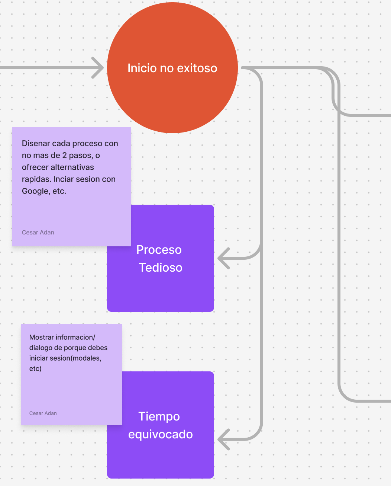

# Figma-practicas

Practica 1: Crea un proyecto en Figjam: https://www.figma.com/es-la/figjam/ 

Crear el UX del iniciar sesion en Figjam
Reproducir lo que esta en la imagen.

a.
1. Colocar los circulos con los textos: Azul: Meta, Verde: accion exitosa, Naranja: error
2. Colocar cuadrados los obstaculos
3. Crear una section para los obstaculos.
4. Traer hacia el frente
   
Para alejar pantalla: ctrl + '-'
Para acercar pantalla: ctrl + '+'

Para traer al frente, seleccionar el objeto 

Sobre este diagrama. Pensar en como llevar al usuario a iniciar sesion.
Pensar en como el iniciar sesion le anadira valor al usuario, para reducir la oportunidad de caso de inicio no exitoso.

b. Anadir las causas

c. Anadir esquemas UX interventions. Para poder iniciar el diseno en Figma. 
Pensar en las posibles soluciones.
Usar un sticky en cada proceso. Ideas de diseno.

   
# Webflow practicas

# Figma  and Webflow practices
Crear un sitio web y una aplicacion.
Crear un mockup inicial y tomar capturas de pantallas a esos disenos iniciales.
Crear wireframings (medium o Hi-fi) para pasar al prototyping.

Opcional(Si da tiempo): Crear un proyecto en Behance, como portafolio para futuros proyectos, etc.

# React and Webflow practices

